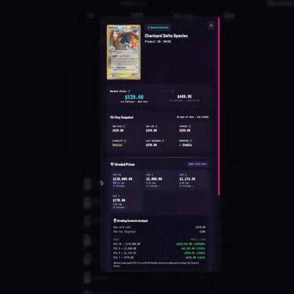

# TCG Oracle — Financial Intelligence API for Collectibles

An x402 micropayment-gated API providing **financial intelligence for the $50B+ trading card market**. AI agents discover this server on the [x402 Bazaar](https://docs.cdp.coinbase.com/x402/bazaar), pay per-call with USDC on Base, and receive institutional-grade analytics with **full model transparency**.

> **This is not a catalog or identification API.** We answer the questions that matter: *"What will this card be worth in 90 days?"* • *"Should I grade this card?"* • *"Where are the undervalued cards right now?"*

<div align="center">



*Financial intelligence for the $50B+ trading card market — powered by x402 micropayments*

</div>

## ⚡ Why This Exists

Every other TCG API tells you *what* a card is. We tell you *what it's worth*, *what it will be worth*, and *whether you should invest in it*. We do this using the same stochastic finance models that Wall Street uses for options pricing — applied to physical collectibles for the first time.

### 28 API Endpoints (12 Paid, 16 Free)

#### 💰 Financial Intelligence (Paid)

| Endpoint | Price | What It Answers |
|----------|-------|----------------|
| `GET /api/v1/grade` | **$0.10** | "What PSA/Beckett grade would this card get?" — 3-stage pipeline: Vision LLM + OpenCV centering + BGS capping. Includes free ROI verdict. |
| `GET /api/v1/grade-or-not` | **$0.10** | "Should I grade this card?" — PSA fee schedule × predicted grade × graded market value = GO/NO-GO |
| `GET /api/v1/simulate` | **$0.015** | "What will this card be worth in 90 days?" — Merton Jump-Diffusion Monte Carlo with VaR/CVaR and full percentile bands |
| `GET /api/v1/trending` | **$0.025** | "What's moving right now?" — Top 50 cards by 30-day sales volume and price velocity |
| `GET /api/v1/arb-grade` | **$0.15** | "Where are the undervalued raw cards?" — Scans database for cards where grading ROI exceeds threshold |
| `POST /api/v1/batch-triage` | **$0.50** | "Which of these 20 cards should I grade first?" — Profit-ranked grading triage |
| `GET /api/v1/portfolio-optimize` | **$0.50** | "How should I allocate my budget?" — Markowitz mean-variance + Merton Jump-Diffusion |
| `GET /api/v1/crypto-oracle` | **$0.05** | "What's this NFT collection worth?" — Alchemy floor + Merton Jump-Diffusion |
| `GET /api/v1/coin-history` | **$0.05** | "Where is this token going?" — CoinGecko OHLC + Monte Carlo |
| `GET /api/v1/arb-cross` | **$1.00** | "Any cross-platform prediction market edges?" — Polymarket vs Kalshi NLI |
| `GET /api/v1/arb-basket` | **$0.50** | "Any guaranteed-profit basket arbs?" — Multi-outcome NO aggregation |
| `GET /api/v1/arb-weather` | **$0.25** | "Any mispriced weather derivatives?" — NWS vs Kalshi |

#### 🆓 Free Tier

| Endpoint | What It Does |
|----------|-------------|
| `GET /api/v1/search` | Search 370K+ TCG products across 25 games |
| `GET /api/v1/market` | Daily market snapshot with top movers |
| `POST /api/v1/recommend` | **Self-navigating API advisor** — describe your goal, get a workflow |
| `GET /api/v1/accuracy` | Public prediction accuracy dashboard (MAE, hit rates) |
| `POST /api/v1/accuracy/report` | Report your actual PSA/BGS grade vs our prediction |
| `POST /api/v1/alerts/subscribe` | Subscribe to price alert webhooks |
| `GET /api/v1/alerts` | List active price alerts |
| `DELETE /api/v1/alerts/{id}` | Unsubscribe from alert |
| `POST /api/v1/alerts/check` | Manually trigger alert evaluation cycle |

### 🔍 Full Model Transparency

Every paid Oracle response ships with the exact `model_params` used to generate the forecast. Your agent doesn't just get a number — it gets the math:

```json
{
  "model": "merton_jump_diffusion",
  "simulations": 20000,
  "model_params": {
    "drift_mu": 0.10,
    "diffusion_sigma": 0.70,
    "jump_intensity_lambda": 4.0,
    "jump_mean_mu_j": -0.05,
    "jump_std_sigma_j": 0.15
  },
  "forecast_percentiles": {
    "5th": 2.6214,
    "25th": 4.3274,
    "50th": 6.0821,
    "75th": 8.4504,
    "95th": 13.7839
  }
}
```

This allows downstream agents to validate assumptions, compare drift parameters against their own priors, or feed the raw percentiles into portfolio optimization engines.

### 🤖 Agent Discovery

| Protocol | Endpoint | Purpose |
|----------|----------|---------|
| **A2A** | `/.well-known/agent.json` | Google A2A Agent Card — 17 skills, peer discovery |
| **OpenAI/Bitte** | `/.well-known/ai-plugin.json` | Plugin manifest with full pricing table |
| **OpenAPI** | `/openapi.json` | Machine-readable endpoint specs |
| **Meta-Tool** | `POST /api/v1/recommend` | Self-navigating workflow advisor |

## 📦 Setup & Installation

**Prerequisites:** Python 3.11+, and a funded Coinbase Developer Platform wallet.

```bash
git clone https://github.com/sailorpepe/undesirables-x402-server.git
cd undesirables-x402-server

python3 -m venv venv
source venv/bin/activate
pip install -r requirements.txt
```

### Environment Configuration
Create a `.env` file in the root directory:

```env
# Your Base receive address
PAYMENT_ADDRESS=0xYOUR_MERCHANT_WALLET

# x402 Mainnet Configuration
FACILITATOR_URL=https://api.cdp.coinbase.com/platform/v2/x402
NETWORK=eip155:8453
USDC_ADDRESS=0x833589fCD6eDb6E08f4c7C32D4f71b54bdA02913

# CDP API Keys (Required for Base Mainnet Discovery & Settlement)
CDP_API_KEY_ID=your_cdp_key_id
CDP_API_KEY_PRIVATE_KEY=your_cdp_private_key

# Alchemy API Key (Required for /api/v1/crypto-oracle)
ALCHEMY_API_KEY=your_alchemy_key

# CoinGecko API Key (Required for /api/v1/coin-history — free tier)
COINGECKO_API_KEY=your_coingecko_key

# Server Config
HOST=0.0.0.0
PORT=8402
```

## 🚀 Running the Server

```bash
python server.py
```

The server automatically registers its JSON schemas with the Coinbase CDP Facilitator upon startup. Once a client successfully triggers the verify-and-settle cycle over the network, your Cloudflare or public IP will be permanently indexed in the global x402 Bazaar.

## 🔒 Security

- **SSRF Protection** — Webhook URLs validated against private/reserved IP ranges
- **WAL Mode** — SQLite databases use Write-Ahead Logging for concurrent safety
- **Rate Limiting** — Per-endpoint rate limits prevent abuse
- **Input Validation** — All user inputs sanitized before processing


## 📝 License & Commercial Use

This project is licensed under the **[Business Source License 1.1 (BUSL-1.1)](LICENSE)**.

We build in public and support the developer ecosystem — but we also protect the infrastructure and IP of **The Undesirables LLC**.

### ✅ What You CAN Do (Free)

- **Personal & Educational Use** — Download, modify, and run locally for learning, research, or personal projects.
- **Non-Competing Applications** — Integrate our packages into your app, provided your app does not offer TCG market intelligence, pricing aggregation, AI card grading, or on-chain price oracle services as its primary function.
- **MCP / Agent Integration** — Connect your AI agent to our tools for non-commercial use.
- **Community Contributions** — Security audits, bug fixes, and PRs are always welcome.

### 🚫 What You CANNOT Do (Use Limitation)

- **Competing Service** — You may not use this code to operate a competing TCG market intelligence, pricing aggregation, AI card grading, or on-chain price oracle service.
- **Commercial Resale** — You may not wrap our API, data pipelines, or AI models into a paid service without a commercial license.
- **Hosted SaaS** — You may not host this software as a service for third parties without written permission.

### 🔓 Open-Source Conversion

On **June 1, 2030** (or 4 years after the first public release of each version), this code automatically converts to the **MIT License** — fully open source, forever.

### 🤝 Commercial Licensing

Building a commercial product? Want guaranteed API access or white-label integration? Contact us:

📧 **theundesirables7@gmail.com** · 🐦 **[@undesirables_ai](https://x.com/undesirables_ai)**

© 2026 The Undesirables LLC
